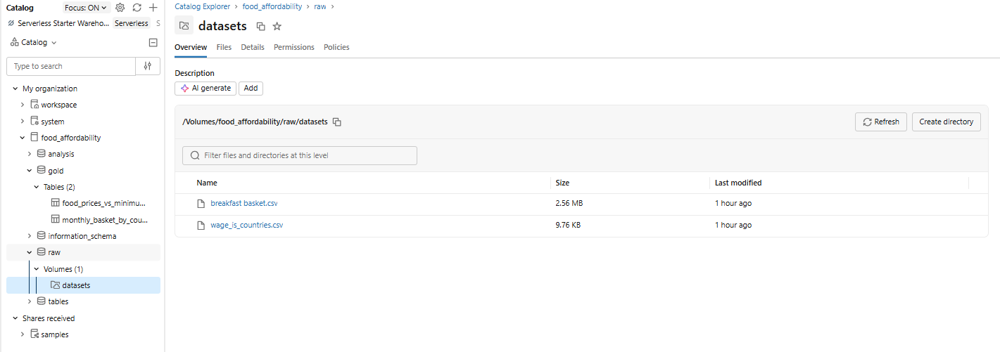
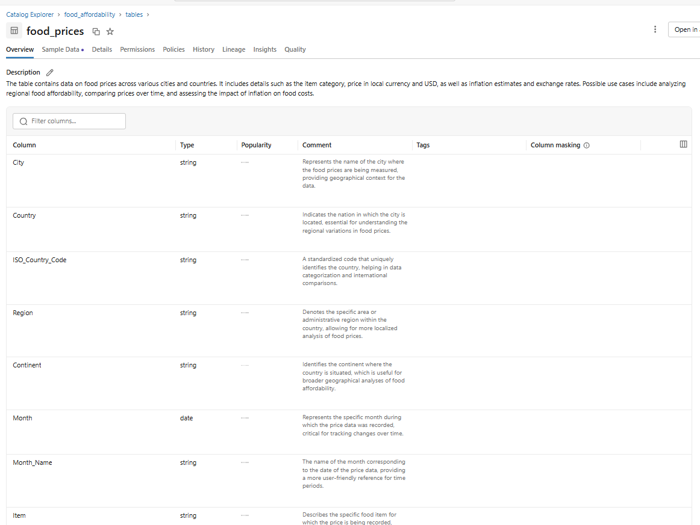
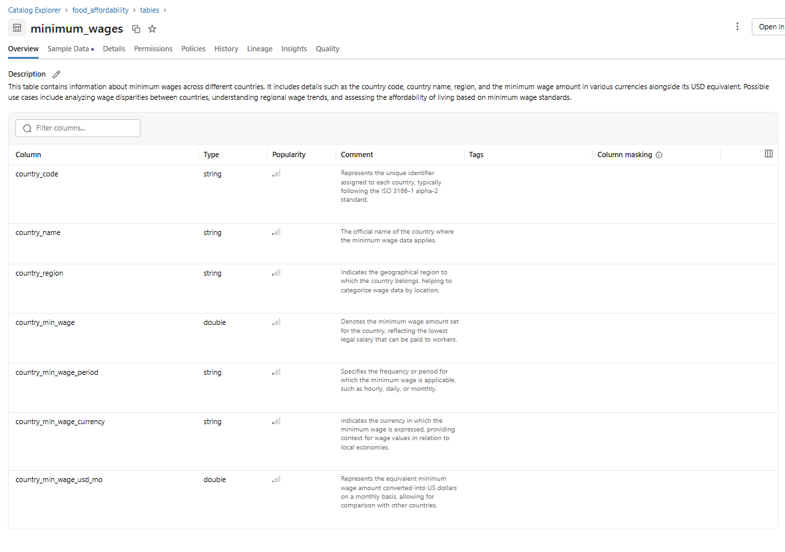

## Contexto de Negócios e Perguntas

O Brasil é o principal produtor e exportador de alimentos na América Latina. Ainda assim, o país retornou ao Mapa da Fome da ONU em 2022, onde permaneceu até 2025. Essa contradição, que atinge vários países com economias voltadas à exportação de commodities, motivou o seguinte tema: **“O quanto de comida é possível comprar com um salário mínimo em diferentes países?”**

O objetivo deste projeto é responder a duas questões principais:

1. Em quais países é possível comprar mais alimentos com um salário mínimo?
2. Quanto a acessibilidade de determinados alimentos (ou categorias alimentares) varia por país?

Para tal, foram utilizados dados de 2026 de 71 países, provenientes do World Food Programme e de outros órgãos governamentais.

## Carga dos Dados

| Dado | Fonte | Data de coleta dos dados | Tipo de licença | Descrição resumida da licença |
|---|---|---|---|---|
| Preço de diversos itens alimentares de café da manhã por país¹ | Numbeo [dataset no Kaggle](https://www.kaggle.com/datasets/waddahali/global-grocery-inflation-20252026) | Março de 2026 | CC BY-NC-SA 4.0 | Livre para uso, adaptação e compartilhamento, conforme as condições da licença. |
| Salários mínimos mensais por país | [wage.is](https://wage.is/sources/) | Setembro de 2026 | CC BY-NC 4.0 | Livre para uso, adaptação e compartilhamento, conforme as condições da licença. |

¹ Apesar de a tabela originalmente se referir a produtos de café da manhã, por conter preços de produtos como arroz, carne e vegetais, a análise foi extrapolada considerando a alimentação diária.

Os dados foram obtidos em formato CSV e carregados no Volume `datasets`, localizado no schema `raw` do catálogo `food_affordability`.

## Modelagem e Catálogo de Dados

Na camada bronze, os arquivos CSV armazenados no Volume `food_affordability.raw.datasets` foram persistidos como tabelas Delta no schema `food_affordability.tables`: `food_prices` e `minimum_wages`.

A descrição completa das tabelas pode ser conferida no notebook, na seção **Create new tables (Bronze)**.

### Tabela: Preços dos alimentos — `food_prices`

**Descrição:** preços de 14 produtos alimentícios, registrados por cidade e mês. A tabela contém 10.248 linhas. A chave primária da tabela é uma combinação de cidade + mês + item.

### Tabela: Salários mínimos — `minimum_wages`

**Descrição:** valores de salário mínimo por país ou território. A tabela contém 225 linhas. A chave primária da tabela é o código do país.

## Qualidade dos Dados

Todas as validações de qualidade dos dados passaram para a tabela `food_prices`:

- Há o mesmo número de ocorrências por cidade durante todo o período.
- Há uma diferença no número de ocorrências por país, o que é esperado devido à diferença no número de cidades de cada um.
- Não há valores nulos.
- A distribuição dos valores faz sentido.

Para simplificar as agregações finais, será utilizado o preço médio do item por país, e não por cidade.

Para a tabela `minimum_wages`, embora haja uma ocorrência por país e a distribuição dos campos numéricos pareça fazer sentido, o valor do salário mínimo aparece nulo em 9% das linhas. Essas linhas serão, portanto, removidas da base final.

## Pipeline de Dados

O processo de pipeline ETL foi realizado em um único notebook, com diferentes seções:

| Seção | Descrição |
|---|---|
| **Imports** | Import das bibliotecas utilizadas na análise e visualização dos dados |
| **Create new catalog** | Criação do catálogo, dos schemas e volumes |
| **Create new tables (Bronze)** | Criação das tabelas Delta |
| **Functions** | Definição das funções auxiliares para avaliar a qualidade dos dados e visualizar suas distribuições |
| **Dataframes validations** | Exibição das validações realizadas |
| **Silver** | Transformações dos dados, incluindo a remoção de valores nulos e de colunas irrelevantes para o problema |
| **Gold** | Criação de tabelas agregadas para visualizar os resultados |

### Silver

Nessa etapa, algumas transformações foram realizadas nos dados:

- **Filtro de data:** Como os dados de salário mínimo foram coletados em 22 de setembro de 2026, foram utilizadas apenas as informações mais recentes dos  preços de alimentos. Embora não seja o ideal, já que a inflação pode ter alterado os preços rapidamente, essas são as fontes mais confiáveis disponíveis no momento. Por este motivo, esse efeito será desconsiderado.
- **Remoção de dados que não podem ser utilizados:** embora alguns países estejam presentes na tabela de salários, aqueles sem informação de salário mínimo foram removidos. Eles representam 9% das ocorrências do DataFrame. Além disso, foram mantidas apenas as colunas úteis para a análise. Colunas relacionadas a taxas de inflação, datas das fontes, etc. foram removidas nesta etapa e não foram utilizadas na análise final.
- **Uso do preço médio por item e por país:** como o objetivo é fazer uma análise comparativa entre países, foi realizado um `groupBy` para obter os preços médios por país, em vez de por cidade. Antes dessa operação, uma validação foi realizada para verificar, por exemplo, se taxas de câmbio diferentes eram usadas para a mesma cidade ou se unidades diferentes eram usadas para o mesmo item. Os testes mostraram que esse não é o caso e que a agregação pode ser feita sem afetar a qualidade dos dados.
- **Junção das duas tabelas:** o join foi realizado pelo código do país, chamado `ISO_Country_Code` na base de preços e `country_code` na base de salários. Como há apenas um registro por país na segunda base, não há risco de gerar linhas duplicadas nessa operação.

### Gold

Nessa etapa, foram criadas duas tabelas: uma com uma linha por item e por país e outra com dados agregados, com uma linha por país.

Na primeira tabela, foi calculada a porcentagem do salário mínimo necessária para comprar cada item em cada país. Com isso, é possível responder quantos itens (ou itens de determinada categoria) podem ser comprados com um salário mínimo.

Na segunda tabela, foi criada uma cesta básica mensal padronizada. Considerando uma família de quatro pessoas (dois adultos e duas crianças), foram sugeridas quantidades que representam um padrão plausível de consumo doméstico e permitem criar o ranking final. Os hábitos alimentares podem variar por país, mas aqui foram consideradas três refeições completas, além de frutas como lanches entre as refeições.

| Item | Quantidade sugerida para o mês | Unidades precificadas na tabela por mês |
|---|---:|---:|
| Pão branco (500 g) | 6 kg | 12 |
| Queijo local (1 kg) | 3,2 kg | 3,2 |
| Leite (1 L) | 28 L | 28 |
| Ovos (12) | 96 ovos | 8 |
| Maçãs (1 kg) | 4 kg | 4 |
| Bananas (1 kg) | 4 kg | 4 |
| Laranjas (1 kg) | 4 kg | 4 |
| Arroz branco (1 kg) | 5 kg | 5 |
| Carne bovina (1 kg) | 12 kg | 12 |
| Filés de frango (1 kg) | 16 kg | 16 |
| Alface (1 unidade) | 12 unidades | 12 |
| Cebolas (1 kg) | 4 kg | 4 |
| Batatas (1 kg) | 10 kg | 10 |
| Tomates (1 kg) | 12 kg | 12 |

As tabelas foram salvas na seguinte estrutura do catálogo:

| Camada | Local |
|---|---|
| **Bronze** | `food_affordability.tables` |
| **Silver** | `food_affordability.analysis` |
| **Gold** | `food_affordability.gold` |

## Análise de Dados/Avaliação

A análise final pode ser encontrada no arquivo `analysis_result.pdf` neste mesmo repositório.
